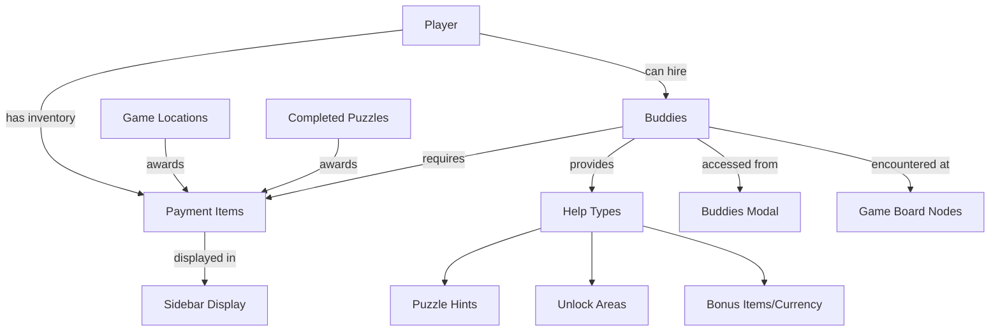

# Buddy Payment System Implementation

## Overview

Create a companion buddy system where your wife's character can hire 7 unique buddies (pets/animals) to help throughout the treasure hunt journey. Each buddy has specific payment preferences and provides different types of assistance.

## Architecture




## Data Models

### Buddies (Hardcoded)

| ID | Name | Species | Breed | Color | Payment Preferences | Help Type | Personality | Movement Type | Idle Animations ||---|---|---|---|---|---|---|---|---|---|| doc | Doc | Dog | Australian Shepherd | Blue Merle | Treats, Bacon | Unlocks new areas, provides compass hints | Loyal, energetic, protective | Roaming (fast) | Tail wag, bark, sniff ground, circle || popples | Popples | Cat | Domestic Shorthair | Grey & White | Salmon, Tuna | Puzzle hints, finds hidden clues | Wise, mysterious, patient | Roaming (slow) | Groom self, stretch, sit regally, slow blink || pippy | Pippy | Cat | Domestic Shorthair | Grey & White | Salmon, Tuna | Puzzle hints, decodes riddles | Playful, curious, clever | Roaming (medium) | Pounce, chase tail, bat at things, zoom || jazz | Jazz | Horse | Arabian | Grey | Hay, Apples | Fast travel between locations, unlocks distant nodes | Graceful, noble, swift | Path-based (gallop routes) | Eat grass, head toss, whinny, **fart randomly** || sweetheart | Sweetheart | Horse | Quarterhorse | Chestnut | Hay, Carrots | Bonus coins/stars, treasure hints | Sweet, gentle, generous | Stationary (gentle sway) | Nuzzle, ear flick, gentle neigh, step in place || chardoneigh | Chardoneigh | Horse | Quarterhorse | Palomino | Hay, Sugar Cubes | Unlocks bonus puzzles, special achievements | Fancy, sophisticated, theatrical | Path-based (dramatic prancing) | Hair flip, dramatic pose, look at camera, strut || alfred | Alfred | Fish | Goldfish | Orange | Fish Flakes, Algae Wafers | Water-related puzzle solver, finds aquatic treasures | Calm, observant, deep-thinking | Float/drift (water areas only) | Blow bubbles, swim in circles, surface for air, contemplate |

### Payment Items

| ID | Name | Icon | Description | Rarity ||---|---|---|---|---|| salmon | Salmon | 🐟 | Fresh salmon, loved by cats | Common || tuna | Tuna | 🐠 | Premium tuna, cat delicacy | Uncommon || treats | Dog Treats | 🦴 | Crunchy dog biscuits | Common || bacon | Bacon | 🥓 | Crispy bacon strips | Uncommon || hay | Hay | 🌾 | Fresh hay bale | Common || apples | Apples | 🍎 | Crisp red apples | Common || carrots | Carrots | 🥕 | Fresh garden carrots | Common || sugar_cubes | Sugar Cubes | 🧊 | Sweet sugar cubes | Uncommon || fish_flakes | Fish Flakes | 🔵 | Premium fish food | Common || algae_wafers | Algae Wafers | 🟢 | Nutritious algae wafers | Uncommon |

## Buddy Movement & Animation System

### Movement Types

**Roaming** - Buddy moves between random valid positions on the board:

- Speed variants: slow (cats), medium (cats), fast (dog)
- Interval: 15-45 seconds between movements
- Path: smooth interpolation between positions
- Boundary: stays within playable board area

**Path-based** - Buddy follows predefined routes:

- Jazz: Galloping routes between key locations
- Chardoneigh: Dramatic prancing path with poses
- Routes stored as waypoint arrays
- Loops continuously

**Stationary** - Buddy stays in fixed location with subtle movement:

- Sweetheart: Gentle swaying in place
- Minor position adjustments for life

**Float/Drift** - Special movement for water-dwelling buddies:

- Alfred: Drifts only in water areas of the board
- Follows water boundaries
- Slow, fluid motion

### Idle Animations

Each buddy has 3-5 idle animations that trigger randomly while stationary or between movements:**Animation Structure**:

```typescript
interface BuddyAnimation {
  id: string;
  name: string;
  duration: number; // milliseconds
  frames?: string[]; // sprite frames or CSS classes
  sound?: string; // optional sound effect
  probability: number; // 0-1, likelihood of triggering
  cooldown?: number; // minimum time before can repeat
}
```

**Special Animations**:

- **Jazz's fart**: Random trigger (5% chance every 30 seconds), sound effect + visual puff cloud
- **Chardoneigh's hair flip**: Dramatic head toss with sparkle effect
- **Pippy's zoom**: Quick dash in random direction
- **Doc's circle**: Spins 360° before lying down

**Animation Timing**:

- Check for idle animation every 5-10 seconds
- Weighted probability based on buddy personality
- Never interrupt movement animation
- Can queue next idle animation

### Buddy Position Data

**Client-side position management** (no backend storage needed):

```typescript
interface BuddyPosition {
  buddyId: string;
  currentPosition: { x: number; y: number }; // percentage-based
  targetPosition?: { x: number; y: number };
  isMoving: boolean;
  currentAnimation?: string;
  lastAnimationTime: number;
  movementRoute?: Array<{ x: number; y: number }>; // for path-based
  currentRouteIndex?: number;
}
```

**Movement Boundaries**:

- Define valid zones for each buddy type (land, water, paths)
- Collision detection (buddies don't stack)
- Minimum distance from player avatar (15% of board)

### Animation Implementation Details

**Spritesheet Approach** (recommended):

- Create sprite sheets for each buddy (idle, walk, special animations)
- Use CSS animation with `steps()` for frame-by-frame
- Example: `animation: buddy-walk 0.8s steps(8) infinite;`

**CSS Transform Approach** (simpler for subtle animations):

- Rotate, translate, scale for basic movements
- Example: Jazz eating grass = rotate head down, pause, rotate up
- Fart effect: `::after` pseudo-element with puff cloud animation

**Sound Effects**:

- Jazz fart: `fart-cartoon.mp3`
- Doc bark: `dog-bark-friendly.mp3`
- Chardoneigh whinny: `horse-dramatic-neigh.mp3`
- Optional mute/volume control in settings

## Backend Implementation

### 1. Database Schema

**buddies table** (seed data):

```sql
CREATE TABLE buddies (
  id VARCHAR(50) PRIMARY KEY,
  name VARCHAR(100) NOT NULL,
  species VARCHAR(50) NOT NULL,
  breed VARCHAR(100),
  color VARCHAR(100),
  description TEXT,
  personality TEXT,
  help_type VARCHAR(50) NOT NULL, -- 'hints', 'unlock', 'items'
  movement_type VARCHAR(50) DEFAULT 'roaming', -- 'roaming', 'path-based', 'stationary', 'float'
  movement_speed VARCHAR(20), -- 'slow', 'medium', 'fast'
  movement_routes JSONB, -- array of waypoints for path-based movement
  idle_animations JSONB, -- array of animation definitions
  sprite_sheet_url VARCHAR(255),
  image_url VARCHAR(255),
  is_active BOOLEAN DEFAULT true,
  created_at TIMESTAMP DEFAULT NOW()
);
```

**payment_items table** (seed data):

```sql
CREATE TABLE payment_items (
  id VARCHAR(50) PRIMARY KEY,
  name VARCHAR(100) NOT NULL,
  icon VARCHAR(10),
  description TEXT,
  rarity VARCHAR(20), -- 'common', 'uncommon', 'rare'
  image_url VARCHAR(255),
  is_active BOOLEAN DEFAULT true,
  created_at TIMESTAMP DEFAULT NOW()
);
```

**buddy_payment_preferences table** (junction table):

```sql
CREATE TABLE buddy_payment_preferences (
  buddy_id VARCHAR(50) REFERENCES buddies(id),
  payment_item_id VARCHAR(50) REFERENCES payment_items(id),
  preference_order INTEGER DEFAULT 1,
  PRIMARY KEY (buddy_id, payment_item_id)
);
```

**player_payment_items table** (inventory):

```sql
CREATE TABLE player_payment_items (
  id SERIAL PRIMARY KEY,
  user_id INTEGER REFERENCES users(id),
  payment_item_id VARCHAR(50) REFERENCES payment_items(id),
  quantity INTEGER DEFAULT 0,
  updated_at TIMESTAMP DEFAULT NOW(),
  UNIQUE(user_id, payment_item_id)
);
```

**buddy_hire_history table** (tracking):

```sql
CREATE TABLE buddy_hire_history (
  id SERIAL PRIMARY KEY,
  user_id INTEGER REFERENCES users(id),
  buddy_id VARCHAR(50) REFERENCES buddies(id),
  payment_item_id VARCHAR(50) REFERENCES payment_items(id),
  help_provided TEXT,
  hired_at TIMESTAMP DEFAULT NOW()
);
```


### 2. NestJS Modules

Create [`backend/src/modules/buddies/`](backend/src/modules/buddies/) module:

- **buddies.entity.ts** - MikroORM entity
- **payment-item.entity.ts** - MikroORM entity
- **player-payment-item.entity.ts** - MikroORM entity
- **buddy-hire-history.entity.ts** - MikroORM entity
- **buddies.service.ts** - Business logic
- **buddies.controller.ts** - API endpoints
- **dto/** - Request/response DTOs

### 3. API Endpoints

```typescript
GET    /api/buddies                    // Get all buddies with payment preferences
GET    /api/buddies/:id                // Get specific buddy details
POST   /api/buddies/:id/hire           // Hire a buddy (deduct payment, provide help)
GET    /api/payment-items              // Get all payment items
GET    /api/payment-items/inventory    // Get player's payment item inventory
POST   /api/payment-items/award        // Award payment items (from puzzles/locations)
GET    /api/buddies/history            // Get player's buddy hire history
```


### 4. Service Methods

**BuddiesService**:

- `getAllBuddies()` - Return all active buddies with payment preferences
- `getBuddyById(id)` - Get single buddy details
- `hireBuddy(userId, buddyId, paymentItemId)` - Validate payment, deduct item, provide help
- `getBuddyHireHistory(userId)` - Get player's interaction history

**PaymentItemsService**:

- `getAllPaymentItems()` - Get all payment items
- `getPlayerInventory(userId)` - Get player's payment item quantities
- `awardPaymentItem(userId, itemId, quantity)` - Add items to inventory
- `deductPaymentItem(userId, itemId, quantity)` - Remove items from inventory
- `hasPaymentItem(userId, itemId, quantity)` - Check if player has enough

## Frontend Implementation

### 1. Update Buddies Modal

Update [`frontend/src/app/features/game/modals/buddies/buddies-modal.component.ts`](frontend/src/app/features/game/modals/buddies/buddies-modal.component.ts):

- Fetch buddies from API
- Display buddy cards with images, names, descriptions
- Show payment preferences with icons
- Show player's current inventory of payment items
- Implement hire button with payment selection
- Display help provided after hiring
- Show hire history (optional collapsible section)

### 2. Create Services

**BuddiesService** ([`frontend/src/app/core/services/buddies.service.ts`](frontend/src/app/core/services/buddies.service.ts)):

- API calls for buddies and hiring
- State management for buddies data
- Cache buddy list

**PaymentItemsService** ([`frontend/src/app/core/services/payment-items.service.ts`](frontend/src/app/core/services/payment-items.service.ts)):

- API calls for payment items and inventory
- State management for inventory
- Observable for inventory updates
- Award/deduct methods

### 3. Sidebar Inventory Display

Update [`frontend/src/app/features/game/sidebar/sidebar.component.ts`](frontend/src/app/features/game/sidebar/sidebar.component.ts):

- Add payment items inventory section below coins/stars
- Display icon + quantity for each item type
- Compact display (show only items with quantity > 0)
- Tooltip on hover showing item name/description

### 4. Game Board Buddy Animation System

Update [`frontend/src/app/features/game/game-board/game-board.component.ts`](frontend/src/app/features/game/game-board/game-board.component.ts):

- Render all 7 buddies on the game board at dynamic positions
- Implement buddy movement system (roaming, path-based, stationary, float)
- Implement idle animation system with random triggers
- Click on buddy → open buddy detail modal for hiring
- Collision detection (buddies don't overlap with each other or player)
- Sound effects for special animations (Jazz's fart, Doc's bark, etc.)

**Buddy Animation Engine**:Create [`frontend/src/app/features/game/services/buddy-animation.service.ts`](frontend/src/app/features/game/services/buddy-animation.service.ts):

- Manage buddy positions and movement state
- Timer-based animation triggers (RxJS intervals)
- Smooth interpolation for movement (easing functions)
- Animation queue management (prevent conflicts)
- Sound effect playback (Web Audio API)
- Respect reduced-motion preferences
- Pause/resume on visibility change

**Buddy Renderer Component**:Create [`frontend/src/app/features/game/game-board/buddy-renderer/buddy-renderer.component.ts`](frontend/src/app/features/game/game-board/buddy-renderer/buddy-renderer.component.ts):

- Render individual buddy sprite with current animation state
- CSS-based sprite animation or transform animations
- Click handler for buddy interaction
- Tooltip showing buddy name on hover
- Visual feedback (glow/pulse) when clickable
- Z-index management (buddies layer above board, below modals)

### 5. Location Rewards

Update location detail modal:

- Add payment item rewards to location completion
- Display items awarded with animation
- Update inventory count in real-time

### 6. Puzzle Rewards

Update puzzles module:

- Add payment item rewards to puzzle completion
- Configure different puzzles to award different items
- Display items earned in success message

## Database Seeding

Create seed file [`database/seeds/02-buddies-and-payments.sql`](database/seeds/02-buddies-and-payments.sql):

- Insert 7 buddies (Doc, Popples, Pippy, Jazz, Sweetheart, Chardoneigh, Alfred)
- Insert 10 payment items
- Insert buddy_payment_preferences junction records
- Include movement types, animation definitions in buddy records
- Ensure idempotent (ON CONFLICT DO NOTHING)

## Assets Required

### Buddy Sprites

Create or source sprites for each buddy:**Directory**: `frontend/public/assets/game/buddies/`| Buddy | Base Sprite | Sprite Sheet | Size | Notes ||---|---|---|---|---|| Doc | `doc-idle.png` | `doc-animations.png` | 80x80px | Frames: idle, walk, bark, sniff, wag || Popples | `popples-idle.png` | `popples-animations.png` | 60x60px | Frames: idle, walk, groom, stretch, sit || Pippy | `pippy-idle.png` | `pippy-animations.png` | 60x60px | Frames: idle, walk, pounce, zoom || Jazz | `jazz-idle.png` | `jazz-animations.png` | 120x120px | Frames: idle, gallop, eat grass, head toss, **fart** || Sweetheart | `sweetheart-idle.png` | `sweetheart-animations.png` | 110x110px | Frames: idle, nuzzle, ear flick, step || Chardoneigh | `chardoneigh-idle.png` | `chardoneigh-animations.png` | 110x110px | Frames: idle, prance, hair flip, dramatic pose || Alfred | `alfred-idle.png` | `alfred-animations.png` | 50x50px | Frames: idle, swim, bubble, surface |**Additional Assets**:

- `fart-cloud.png` - Puff effect for Jazz's fart
- `sparkle.png` - Effect for Chardoneigh's dramatic moments
- `heart.png` - Effect for Sweetheart's nuzzle
- `bubble.png` - Effect for Alfred's bubbles

### Sound Effects

**Directory**: `frontend/public/assets/sounds/buddies/`| Sound File | Description | Duration | Format ||---|---|---|---|| `doc-bark.mp3` | Friendly dog bark | ~0.5s | MP3 || `doc-bark.ogg` | Fallback | ~0.5s | OGG || `jazz-fart.mp3` | Cartoon fart sound | ~0.8s | MP3 || `jazz-fart.ogg` | Fallback | ~0.8s | OGG || `jazz-whinny.mp3` | Horse whinny | ~1s | MP3 || `chardoneigh-neigh.mp3` | Dramatic horse neigh | ~1.2s | MP3 || `cat-meow.mp3` | Soft cat meow | ~0.5s | MP3 || `bubble-pop.mp3` | Gentle bubble sound | ~0.3s | MP3 |**Sound Resources**:

- Use royalty-free sources (freesound.org, zapsplat.com)
- Fallback to silent operation if sounds fail to load
- Keep file sizes small (<50KB per sound)

### Asset Generation Options

1. **Custom Pixel Art**: Create in Aseprite or Piskel for retro game aesthetic
2. **AI Generation**: Use Midjourney/DALL-E with pixel art style prompts
3. **Stock Assets**: Purchase from itch.io, OpenGameArt.org
4. **Photos + Effects**: Use real pet photos with CSS filters and cutouts

## Styling

Follow existing CSS variable system from [`frontend/src/styles.scss`](frontend/src/styles.scss):

- Buddy cards: warm backgrounds, golden borders
- Payment item icons: consistent sizing (24px in modal, 18px in sidebar)
- Hire button: golden gradient, hover effects
- Inventory display: compact grid layout
- Animations: smooth fade-ins, bounce effects on awards

**Buddy Sprites on Game Board**:

- Buddy size: 60-120px depending on species (horses larger, fish smaller)
- Movement animation: smooth `translate` with `transition: transform 2s ease-in-out`
- Idle animations: CSS `@keyframes` or sprite sheet frame stepping
- Hover state: scale up slightly (1.05x), cursor pointer, subtle glow
- Active animation visual: animation-specific transforms/effects
- Fart cloud: `::after` pseudo-element with puff sprite, fade out animation
- Z-index: buddies layer (`var(--z-index-buddies)` = 50, between board and modals)

**Sound Effects**:

- Volume control in settings modal
- Respect user's mute preference
- Load sounds lazily (only when buddy first animates)
- Fallback: silent if audio fails to load

## Implementation Todos

The plan breaks down into these key tasks:

1. **Backend: Database schema and migrations** - Create tables for buddies, payment items, inventory, preferences (include movement/animation fields)
2. **Backend: Buddies module with entities and services** - Implement MikroORM entities, service logic for hiring/validation
3. **Backend: API endpoints** - Create controller endpoints for buddies, inventory, and hiring
4. **Backend: Database seeding** - Insert 7 hardcoded buddies with movement types, animations, and payment item data
5. **Frontend: Buddies service and payment items service** - API integration services
6. **Frontend: Update buddies modal** - Rich UI for viewing buddies, selecting payment, hiring
7. **Frontend: Sidebar inventory display** - Show payment item quantities
8. **Frontend: Buddy animation engine** - Create animation service for movement and idle behaviors
9. **Frontend: Buddy renderer component** - Render buddies on game board with animations
10. **Frontend: Game board integration** - Add buddies to board, handle clicks, sound effects
11. **Assets: Buddy sprites and sounds** - Create/source sprites, sprite sheets, sound effects
12. **Integration: Location and puzzle rewards** - Award payment items on completion
13. **Testing: End-to-end flow** - Test finding items, hiring buddies, animations, receiving help

## Testing Checklist

**Buddy System**:

- [ ] All 7 buddies appear in buddies modal
- [ ] All 7 buddies render on game board
- [ ] Payment preferences are correctly displayed
- [ ] Player can view inventory in sidebar
- [ ] Hiring buddy deducts correct payment item
- [ ] Cannot hire without sufficient payment
- [ ] Different buddies provide appropriate help types
- [ ] Hire history tracks all interactions
- [ ] API validation prevents invalid hires

**Movement & Animation**:

- [ ] Doc roams around board at fast speed
- [ ] Popples roams slowly, Pippy roams at medium speed
- [ ] Jazz follows galloping path routes
- [ ] Chardoneigh prances dramatically on path
- [ ] Sweetheart stays stationary with gentle sway
- [ ] Alfred floats/drifts in water areas only
- [ ] Buddies don't overlap with each other
- [ ] Buddies don't overlap with player avatar
- [ ] Movement transitions are smooth (no jumps)

**Idle Animations**:

- [ ] Each buddy shows idle animations when stationary
- [ ] Jazz eats grass and farts randomly (visual + sound)
- [ ] Animations trigger at appropriate intervals
- [ ] Animations respect reduced-motion preference
- [ ] Sound effects play correctly (with mute option)
- [ ] Special animations (fart, zoom, etc.) work as expected

**Rewards & Inventory**:

- [ ] Payment items awarded from puzzle completion
- [ ] Payment items awarded from location discovery
- [ ] Inventory counts update in real-time
- [ ] Inventory display shows correct items

**Interaction**:

- [ ] Clicking buddy opens buddies modal for that buddy
- [ ] Hover on buddy shows name tooltip
- [ ] Buddies have visual feedback on hover
- [ ] Can hire buddy directly from game board interaction

## Future Enhancements

**Buddy System**:

- Buddy loyalty system (discounts after multiple hires)
- Special buddy combo bonuses (hire multiple at once)
- Buddy customization (accessories, names, outfits)
- Buddy leveling system (more powerful help over time)
- Buddy dialogue system (unique voice/personality quotes)

**Animations & Interactions**:

- Player can pet/interact with buddies for bonus effects
- Buddies interact with each other (Doc chases cats, horses nuzzle)
- Weather-based animations (Jazz seeks shelter in rain)
- Time-of-day behaviors (Alfred more active at dawn, cats nap midday)
- Seasonal animations (Jazz rolls in snow, Alfred in frozen pond)
- More idle animations per buddy (expanded behavior sets)

**Economy & Rewards**:

- Seasonal payment items (limited time)
- Trading payment items between players (if multiplayer added)
- Buddy-specific achievements (hire Jazz 10 times, etc.)