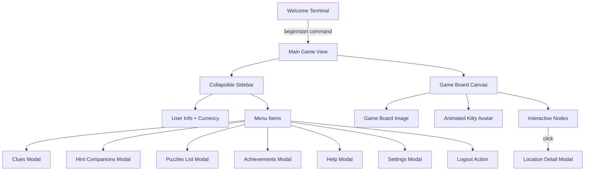

# Main Treasure Hunt Game View

## Overview

Create the main game interface that appears after login with an interactive game board, progress-tracking avatar, and collapsible sidebar with modal navigation.**Visual Transition**: When users type `begin` or `start` in the terminal welcome screen, they transition from the terminal aesthetic to a rich, modern game interface. The game view uses warm, adventurous colors inspired by the game board (golds, ambers, teals, earthy browns) - completely moving away from the terminal green theme. This creates an immersive "stepping into the adventure" experience.

## Architecture




## Component Structure

### 1. Main Game View Component (`game-view.component.ts`)

**Route**: `/game`**Layout**:

- Desktop: Sidebar expanded (300px), game board fills remaining space
- Mobile: Sidebar collapsed (hamburger menu), game board full width

**Responsibilities**:

- Container for sidebar and game board
- Manage sidebar collapse state
- Handle modal opening/closing
- Track user progress state

### 2. Sidebar Component (`sidebar.component.ts`)

**User Info Section**:

```typescript
interface UserInfo {
  username: string;
  avatarUrl?: string;
  coins: number;
  stars: number;
  level?: number;
}
```

**Menu Items**:

- 🗝️ Clues - Current active clues
- 🐾 Buddies - Hint companion system
- 🎯 Puzzles - All puzzles with status
- 🏆 Achievements - Unlocked badges
- ❓ Help - Instructions and tips
- ⚙️ Settings - User preferences
- 🚪 Logout - Return to login

**Mobile Behavior**:

- Hamburger icon (☰) in top-left
- Slide-in drawer animation
- Backdrop overlay when open
- Close on outside click or menu item selection

### 3. Game Board Component (`game-board.component.ts`)

**Features**:

- Display game-board.png as background
- Overlay interactive nodes/locations
- Animate kitty avatar between nodes
- Show current position and unlocked locations
- Handle node clicks → open location details

**Avatar Sizing**:

- Desktop: Avatar ~60-80px height
- Mobile: Avatar ~40-50px height
- Proportional to game board (aim for ~1/20th of board height)

**Node System**:

```typescript
interface GameNode {
  id: string;
  position: { x: number, y: number }; // percentage-based
  status: 'locked' | 'unlocked' | 'current' | 'completed';
  puzzleId?: string;
  locationName: string;
}
```

**Animation**:

- Use Angular animations for avatar movement
- Smooth path transition between nodes
- Duration: ~1-2 seconds per node
- Easing: ease-in-out

### 4. Modal Components

**Base Modal Service** (`modal.service.ts`):

- Centralized modal management
- Stack-based (multiple modals supported)
- Backdrop, close on ESC, close button
- Responsive sizing

**Individual Modals**:**A. Clues Modal** - Display active clues for current puzzle**B. Buddies Modal** - Show hint companions (NPCs that provide help)**C. Puzzles Modal** - List all puzzles with completion status**D. Achievements Modal** - Display unlocked badges/achievements**E. Help Modal** - Instructions and game guide**F. Settings Modal** - User preferences (sound, notifications, etc.)**G. Location Detail Modal** - Opens when clicking game board nodes

## Styling Resources

**Complete styling guidelines**: `.cursor/rules/styling/RULE.md`This includes:

- Full CSS variables reference
- BEM naming conventions
- Responsive design patterns
- Accessibility requirements
- Animation best practices
- Common component patterns

**All developers must follow the styling rule for consistency.**

## Implementation Steps

### Phase 1: Core Structure & Routing

0. **Setup CSS variables system**

- Create/update `frontend/src/styles.scss` with all CSS variables
- Import Google Fonts (Cinzel, Lato, Open Sans)
- Setup global resets and base styles
- Add reduced motion media query
- Test CSS variables are accessible throughout app

1. **Create game module and routing**

- Add `/game` route with auth guard
- Create GameViewComponent as container
- Update welcome component to navigate on `begin/start`
- Add route transition animation (fade-out terminal, fade-in game view)

2. **Create shared modal service**

- Implement modal stack management
- Create base modal component
- Add backdrop and animations

### Phase 2: Sidebar Implementation

3. **Build sidebar component**

- User info header with currency display
- Menu items with icons
- Collapse/expand functionality
- Mobile hamburger menu
- Responsive animations

4. **Add currency tracking**

- Create currency service
- Display coins and stars
- Update on puzzle completion

### Phase 3: Game Board

5. **Implement game board component**

- Display game-board.png as background
- Make responsive (contain/cover)
- Define node positions (percentage-based)

6. **Add avatar overlay**

- Position cute-kitty-avatar.png
- Implement movement animations
- Track current node position

7. **Implement interactive nodes**

- Render node markers on board
- Visual states (locked/unlocked/current/completed)
- Click handlers → open location modals

### Phase 4: Modal Features

8. **Create modal components**

- Clues modal with current puzzle clues
- Buddies modal (hint companion system)
- Puzzles modal (list with status)
- Achievements modal (badge grid)
- Help modal (game instructions)
- Settings modal (preferences)
- Location detail modal (node info)

9. **Wire up navigation**

- Connect sidebar menu items to modals
- Add modal close handlers
- Test modal stacking

### Phase 5: Polish & Responsive

10. **Responsive design**

    - Test on various screen sizes
    - Optimize avatar and board ratios
    - Ensure touch-friendly on mobile
    - Smooth animations

11. **Accessibility**

    - Keyboard navigation
    - ARIA labels
    - Focus management in modals

## File Structure

```javascript
frontend/src/app/
├── features/
│   └── game/
│       ├── game.routes.ts
│       ├── game-view/
│       │   ├── game-view.component.ts
│       │   ├── game-view.component.html
│       │   └── game-view.component.scss
│       ├── sidebar/
│       │   ├── sidebar.component.ts
│       │   ├── sidebar.component.html
│       │   └── sidebar.component.scss
│       ├── game-board/
│       │   ├── game-board.component.ts
│       │   ├── game-board.component.html
│       │   └── game-board.component.scss
│       └── modals/
│           ├── clues/
│           ├── buddies/
│           ├── puzzles/
│           ├── achievements/
│           ├── help/
│           ├── settings/
│           └── location-detail/
├── shared/
│   ├── services/
│   │   ├── modal.service.ts
│   │   ├── currency.service.ts
│   │   └── game-progress.service.ts
│   └── components/
│       └── modal/
│           ├── modal.component.ts
│           ├── modal.component.html
│           └── modal.component.scss
└── core/
    └── models/
        ├── game-node.model.ts
        ├── user-progress.model.ts
        └── currency.model.ts
```


## Assets to Add

```javascript
frontend/public/
└── assets/
    └── game/
        ├── game-board.png (from .local-docs)
        ├── avatar-kitty.png (from .local-docs)
        ├── node-locked.svg (create)
        ├── node-unlocked.svg (create)
        ├── node-current.svg (create)
        └── node-completed.svg (create)
```


## Styling Considerations

### Design Philosophy

The game view creates a modern, immersive treasure hunt experience by drawing inspiration from the game board's aesthetic:

- **Warm & Inviting**: Golden sands, ancient temples, lush jungles
- **Adventure Feel**: Treasure maps, aged parchment, mystical artifacts
- **Polish**: Smooth animations, thoughtful interactions, delightful details
- **Accessibility**: Clear contrast, readable fonts, touch-friendly

### CSS Variables System

All colors, spacing, and design tokens are defined as CSS variables in `frontend/src/styles.scss` for consistency and easy theming.**Key Variable Categories**:

- **Colors**: `--color-gold-*`, `--color-sand-*`, `--color-teal-*`, `--color-brown-*`
- **Spacing**: `--spacing-xs` through `--spacing-3xl` (4px to 64px scale)
- **Typography**: `--font-family-*`, `--font-size-*`, `--font-weight-*`
- **Shadows**: `--shadow-sm` through `--shadow-xl`, plus special effects
- **Borders**: `--border-radius-*`, `--border-width-*`, `--border-color-*`
- **Transitions**: `--transition-fast/normal/slow`
- **Z-Index**: Predefined layers to prevent conflicts
- **Components**: `--sidebar-width`, `--avatar-size-*`, etc.

**See**: `.cursor/rules/styling/RULE.md` for complete variable reference and usage guidelines.**Example Usage**:

```scss
.sidebar {
  background: var(--color-background-primary);
  border: var(--border-width-medium) solid var(--color-gold-primary);
  padding: var(--spacing-lg);
  box-shadow: var(--shadow-lg);
  transition: all var(--transition-normal);
}
```


### Component Styling

**Sidebar**:

- Background: `var(--color-background-primary)` - Semi-transparent dark overlay
- Borders: `var(--border-width-medium) solid var(--color-gold-primary)`
- Menu items: Hover with `box-shadow: var(--shadow-gold)`
- Font: `var(--font-family-primary)` - Clean, modern sans-serif
- Padding: `var(--spacing-lg)`
- Transition: `var(--transition-normal)`

**Currency Display**:

- Coin icon: Golden animated shimmer effect
- Star icon: Sparkling animation on increase  
- Numbers: `var(--font-size-2xl)`, `var(--font-weight-bold)`
- Color: `var(--color-gold-primary)`
- Container: `border-radius: var(--border-radius-lg)`

**Game Board**:

- Full bleed background image
- Subtle vignette overlay for focus
- Responsive scaling (maintain aspect ratio)

**Node Markers**:

- Size: `var(--node-size-desktop)` on desktop, `var(--node-size-mobile)` on mobile
- Locked: Gray/desaturated with lock icon, subtle pulse
- Unlocked: `box-shadow: var(--shadow-gold)`, breathing animation
- Current: Bright amber pulse, `transform: scale(1.2)`
- Completed: `color: var(--color-success)`, checkmark, subtle shimmer

**Modals**:

- Background: `var(--color-background-modal)` - Parchment texture
- Border radius: `var(--border-radius-xl)`
- Padding: `var(--modal-padding)`
- Headers: Golden gradient with `var(--color-gold-*)`
- Shadows: `var(--shadow-xl)` for depth
- Z-index: `var(--z-index-modal)`
- Max width: `var(--modal-max-width)`

**Animations**:

- Avatar movement: Smooth bezier curve path following
- Currency updates: Bounce and count-up animation
- Modal entrance: Fade + scale from center
- Sidebar slide: Smooth ease-out transition
- Node interactions: Scale up on hover, ripple on click

**Typography**:

- Headings: `var(--font-family-heading)` - Cinzel, Playfair Display
- Body: `var(--font-family-primary)` - Lato, Open Sans
- Display text: `var(--font-family-display)` - Cinzel Decorative
- Currency: `var(--font-size-2xl)`, `var(--font-weight-bold)`
- Menu items: `var(--font-weight-medium)`
- Line heights: Use `var(--line-height-*)` variables

**Responsive Design**:

- Touch targets: Minimum 44x44px (use CSS variables for sizing)
- Breakpoints: Use `@media (min-width: 768px)` etc. (see styling rule)
- Sidebar: `width: var(--sidebar-width)` on desktop, 100% on mobile
- Avatar: `var(--avatar-size-desktop)` / `var(--avatar-size-mobile)`
- Spacing: Use `var(--spacing-*)` scale for all margins/padding
- Mobile-first approach throughout

**Effects & Polish**:

- Particle effects on achievements unlocked
- Subtle parallax on game board background
- Transitions: Use `var(--transition-*)` variables consistently
- Loading states: Treasure chest opening animation
- Error states: Gentle shake (300ms)
- Success states: Golden confetti burst
- Reduced motion: Respect `@media (prefers-reduced-motion: reduce)`

## Testing Checklist

- [ ] Navigation from welcome to game works
- [ ] Sidebar collapses/expands on desktop
- [ ] Sidebar drawer works on mobile
- [ ] All modals open and close correctly
- [ ] Avatar animates between nodes
- [ ] Node clicks open location details
- [ ] Currency displays correctly
- [ ] Responsive on mobile and desktop
- [ ] Logout returns to login screen
- [ ] Back button handling

## Future Enhancements

- Real-time progress updates