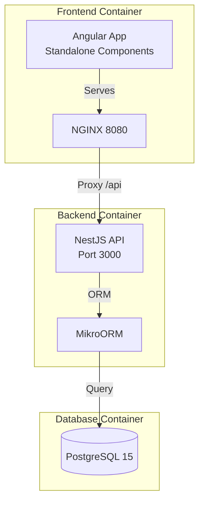

# Treasure Hunt Application - Initial Setup (Rule-Aligned)

## Architecture Overview



## Project Structure

```
project-67/
├── frontend/              # Angular standalone app
│   ├── src/
│   │   ├── app/
│   │   │   ├── core/     # Services, guards, interceptors
│   │   │   ├── features/ # Feature modules
│   │   │   └── shared/   # Reusable components
│   │   └── environments/
│   ├── Dockerfile
│   ├── nginx.conf
│   └── .dockerignore
├── backend/               # NestJS API
│   ├── src/
│   │   ├── modules/      # Feature modules (auth, puzzles, hints)
│   │   ├── core/         # Global filters, guards, interceptors
│   │   ├── shared/       # Shared services
│   │   ├── config/       # Configuration
│   │   └── main.ts       # Bootstrap
│   ├── Dockerfile
│   ├── .dockerignore
│   └── mikro-orm.config.ts
├── database/
│   └── init.sql
├── docker-compose.yml
├── .env.example
├── .gitignore
└── README.md
```

## 1. Root Configuration Files

### [`docker-compose.yml`](docker-compose.yml)

- PostgreSQL 15-alpine with health checks
- NestJS backend with MikroORM
- Angular frontend served by NGINX
- Named volumes for database persistence
- Custom network for service isolation
- Environment variable validation (`:?` for required vars)
- Service dependencies with `condition: service_healthy`

### [`.env.example`](.env.example)

Environment variables following Docker rules:

- DB_NAME, DB_USER, DB_PASSWORD, DB_HOST, DB_PORT
- JWT_ACCESS_SECRET, JWT_REFRESH_SECRET (min 32 chars)
- JWT_ACCESS_EXPIRES_IN, JWT_REFRESH_EXPIRES_IN
- CORS_ORIGINS
- NODE_ENV, PORT

### [`.gitignore`](.gitignore)

Exclude: node_modules, .env files, dist/, build/, .angular/, coverage/, OS files, IDE files

### [`README.md`](README.md)

- Architecture overview with diagram
- Prerequisites (Node 20+, Docker, Angular CLI)
- Local development setup
- Environment variables documentation
- Docker commands
- Deployment to Raspberry Pi guide

## 2. Database Setup

### [`database/init.sql`](database/init.sql)

**Schema following PostgreSQL rules:**

- Use `snake_case` for all identifiers
- Use `UUID DEFAULT gen_random_uuid()` for primary keys
- Use `TIMESTAMP WITH TIME ZONE` for all timestamps
- Add `created_at` to all tables
- Add `updated_at` with trigger for mutable tables
- Specify `ON DELETE` behavior for foreign keys
- Add indexes for foreign keys and query patterns
- Use `JSONB` for flexible data (puzzle_data)
- Add `CHECK` constraints for validation
- Wrap in `BEGIN; ... COMMIT;` transaction
- Use `IF NOT EXISTS` for idempotency

**Tables:**

1. `users` - UUID id, username, email, password_hash
2. `puzzles` - Serial id, order_number, title, puzzle_type, puzzle_data (JSONB), solution_hash, image_url
3. `user_progress` - Track completion per user/puzzle
4. `hints` - Multiple hints per puzzle with ordering
5. `hint_requests` - Track hint usage
6. `refresh_tokens` - JWT refresh tokens
7. `activity_log` - Optional audit trail

**Functions & Triggers:**

- `update_updated_at()` function for auto-updating timestamps

## 3. Backend Application (NestJS)

### Initialize NestJS Project

**Dependencies:**

```json
{
  "@nestjs/core": "^10.0.0",
  "@nestjs/common": "^10.0.0",
  "@nestjs/platform-express": "^10.0.0",
  "@mikro-orm/core": "^5.9.0",
  "@mikro-orm/postgresql": "^5.9.0",
  "@mikro-orm/nestjs": "^5.2.0",
  "@nestjs/jwt": "^10.0.0",
  "@nestjs/passport": "^10.0.0",
  "passport-jwt": "^4.0.1",
  "bcrypt": "^5.1.0",
  "class-validator": "^0.14.0",
  "class-transformer": "^0.5.1",
  "sharp": "^0.33.0"
}
```

### Backend Structure

```
backend/src/
├── modules/
│   ├── auth/
│   │   ├── auth.module.ts
│   │   ├── auth.controller.ts
│   │   ├── auth.service.ts
│   │   ├── strategies/       # JWT strategy
│   │   └── dto/              # Login, Register DTOs
│   ├── puzzles/
│   │   ├── puzzles.module.ts
│   │   ├── puzzles.controller.ts
│   │   ├── puzzles.service.ts
│   │   ├── entities/         # MikroORM entities
│   │   └── dto/              # DTOs with class-validator
│   └── health/
│       ├── health.module.ts
│       └── health.controller.ts
├── core/
│   ├── filters/              # Global exception filter
│   ├── guards/               # JWT auth guard
│   ├── interceptors/         # Logging, transform
│   └── core.module.ts
├── shared/
│   ├── shared.module.ts
│   └── utils/
├── config/
│   ├── database.config.ts
│   ├── jwt.config.ts
│   └── app.config.ts
└── main.ts
```

### Key Files

**[`backend/src/main.ts`](backend/src/main.ts)**

- Bootstrap NestJS application
- Enable CORS with environment-based origins
- Global validation pipe
- Health check endpoint
- Listen on PORT from environment

**[`backend/mikro-orm.config.ts`](backend/mikro-orm.config.ts)**

- PostgreSQL configuration
- Entity discovery
- Migration settings
- Debug mode for development

**[`backend/Dockerfile`](backend/Dockerfile)**

- Multi-stage build (builder → production)
- Node 20-alpine base image
- Non-root user (nodejs:nodejs)
- npm ci for reproducible builds
- Health check on /health endpoint
- Expose port 3000

**[`backend/.dockerignore`](backend/.dockerignore)**

- Exclude node_modules, dist, tests, .env, git, IDE files

## 4. Frontend Application (Angular)

### Initialize Angular Project

Use Angular CLI with:

- Standalone components
- SCSS for styling
- Routing enabled

### Frontend Structure

```
frontend/src/app/
├── core/
│   ├── services/
│   │   ├── auth.service.ts
│   │   ├── puzzle.service.ts
│   │   └── hint.service.ts
│   ├── guards/
│   │   └── auth.guard.ts
│   ├── interceptors/
│   │   └── auth.interceptor.ts
│   └── models/
│       ├── user.model.ts
│       ├── puzzle.model.ts
│       └── progress.model.ts
├── features/
│   ├── auth/
│   ├── puzzle/
│   └── progress/
├── shared/
│   ├── components/
│   └── pipes/
└── app.config.ts
```

### Key Files

**[`frontend/src/environments/environment.ts`](frontend/src/environments/environment.ts)**

```typescript
export const environment = {
  production: false,
  apiUrl: 'http://localhost:3000/api'
};
```

**[`frontend/src/environments/environment.prod.ts`](frontend/src/environments/environment.prod.ts)**

```typescript
export const environment = {
  production: true,
  apiUrl: '/api'  // Proxied by NGINX
};
```

**[`frontend/Dockerfile`](frontend/Dockerfile)**

- Multi-stage: builder (Node 20-alpine) → production (NGINX 1.25-alpine)
- Build Angular with `--configuration production`
- Copy to `/usr/share/nginx/html`
- Run NGINX as non-root user
- Expose port 8080 (non-privileged)
- Health check on /health endpoint

**[`frontend/nginx.conf`](frontend/nginx.conf)**

- Listen on port 8080
- Serve Angular from /usr/share/nginx/html
- Proxy `/api/*` to `http://backend:3000`
- Enable gzip compression
- Security headers (X-Frame-Options, X-Content-Type-Options, etc.)
- Cache static assets (1 year)
- Health check endpoint at `/health`
- Mobile-friendly configuration

**[`frontend/.dockerignore`](frontend/.dockerignore)**

- Exclude node_modules, dist, .angular, tests, .env, git, IDE files

## 5. Docker Compose Configuration

**[`docker-compose.yml`](docker-compose.yml) services:**

### Database Service

- Image: `postgres:15-alpine`
- Container name: `treasure-hunt-db`
- Environment: POSTGRES_DB, POSTGRES_USER, POSTGRES_PASSWORD
- Volume: `postgres_data` for persistence
- Volume mount: `./database/init.sql:/docker-entrypoint-initdb.d/init.sql:ro`
- Health check: `pg_isready -U ${DB_USER}`
- Network: `treasure-hunt-network`
- Restart: `unless-stopped`

### Backend Service

- Build: `./backend` with target `production`
- Container name: `treasure-hunt-backend`
- Depends on: db (condition: service_healthy)
- Environment: DATABASE_*, JWT_*, NODE_ENV, PORT
- Expose: port 3000
- Volume: `./backend/uploads` for file storage
- Health check: wget on `/health`
- Network: `treasure-hunt-network`
- Restart: `unless-stopped`

### Frontend Service

- Build: `./frontend` with target `production`
- Container name: `treasure-hunt-frontend`
- Depends on: backend (condition: service_healthy)
- Expose: ports 80:8080 and 443:8443
- Health check: wget on `/health`
- Network: `treasure-hunt-network`
- Restart: `unless-stopped`

**Named Volumes:** `postgres_data` for database persistence

**Networks:** `treasure-hunt-network` with bridge driver

## 6. Development Scripts

Create root [`package.json`](package.json) with workspace scripts:

```json
{
  "name": "treasure-hunt-monorepo",
  "private": true,
  "scripts": {
    "docker:up": "docker compose up -d",
    "docker:down": "docker compose down",
    "docker:logs": "docker compose logs -f",
    "docker:rebuild": "docker compose up -d --build",
    "dev:backend": "cd backend && npm run start:dev",
    "dev:frontend": "cd frontend && ng serve",
    "build": "npm run build:backend && npm run build:frontend",
    "build:backend": "cd backend && npm run build",
    "build:frontend": "cd frontend && npm run build"
  }
}
```

## Implementation Steps

### Step 1: Root Configuration

1. Create `.env.example` with all required variables
2. Create `.gitignore` excluding sensitive files
3. Create `docker-compose.yml` with all three services
4. Create comprehensive `README.md`

### Step 2: Database

1. Create `database/init.sql` with complete schema
2. Add `update_updated_at()` trigger function
3. Create indexes for foreign keys and query patterns
4. Add initial seed data (optional)

### Step 3: Backend (NestJS)

1. Initialize NestJS project: `nest new backend`
2. Install dependencies (MikroORM, JWT, bcrypt, class-validator)
3. Configure MikroORM with PostgreSQL
4. Create core module (filters, guards, interceptors)
5. Create health module with endpoints
6. Create auth module stub (controller, service, DTOs)
7. Create puzzles module stub
8. Create Dockerfile with multi-stage build
9. Create `.dockerignore`

### Step 4: Frontend (Angular)

1. Initialize Angular project: `ng new frontend --standalone --style=scss`
2. Create environment files with API URLs
3. Set up core folder structure (services, guards, models)
4. Create feature folders (auth, puzzle, progress)
5. Create shared folder for reusable components
6. Create Dockerfile with multi-stage build
7. Create `nginx.conf` for serving and proxying
8. Create `.dockerignore`

### Step 5: Integration Testing

1. Build all images: `docker compose build`
2. Start services: `docker compose up -d`
3. Check health: `docker compose ps`
4. Test database: `docker compose exec db psql -U treasure_user -d treasure_hunt -c "\dt"`
5. Test backend: `curl http://localhost:3000/health`
6. Test frontend: `curl http://localhost/health`
7. Verify logs: `docker compose logs`

## Expected Outcome

After implementation:

- ✅ Complete monorepo structure
- ✅ NestJS backend with modular architecture
- ✅ Angular frontend with standalone components
- ✅ PostgreSQL database with complete schema
- ✅ Docker Compose environment running all services
- ✅ Health checks passing for all containers
- ✅ NGINX proxying API requests
- ✅ Type-safe interfaces across stack
- ✅ Ready for feature development (auth, puzzles, hints)

## Next Phase (Not in This Plan)

1. Implement authentication (JWT, bcrypt password hashing)
2. Build puzzle display and submission logic
3. Add hint system with request tracking
4. Implement console easter eggs
5. Add image manipulation with Sharp
6. Set up Cloudflare Tunnel for remote access
7. Deploy to Raspberry Pi